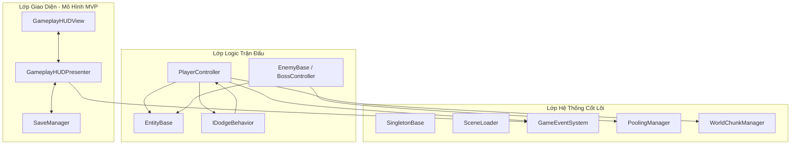

# CHƯƠNG 3: THIẾT KẾ KIẾN TRÚC VÀ HỆ THỐNG GIAO DIỆN

## 3.1. Thiết kế hệ thống kiến trúc cốt lõi

Để đáp ứng nhịp độ nhanh và lượng dữ liệu lớn của một tựa game 3D Action RPG thời gian thực, kiến trúc phần mềm của **"Dawn of Shadow"** được thiết kế dựa trên nguyên lý tách biệt trách nhiệm (*Separation of Concerns*). Hệ thống được chia thành các lớp quản lý độc lập, kế thừa từ lớp cha đơn mẫu luồng an toàn (`SingletonBase<T>`), và giao tiếp thông qua sự kiện phi tập trung thay vì tham chiếu cứng trực tiếp.



---

### 3.1.1. Máy trạng thái vòng đời trò chơi (Global Game State Machine)

Toàn bộ vòng đời của ứng dụng được điều phối bởi hệ thống quản lý cảnh chơi và trạng thái tập trung. Sự chuyển đổi giữa các trạng thái được thực thi thông qua lớp quản lý bất đồng bộ `SceneLoader` kế thừa từ `SingletonBase<SceneLoader>`, đảm bảo thu hồi bộ nhớ đệm và giải phóng rác hệ thống (Garbage Collection) khi chuyển tiếp giữa các cảnh.

Mỗi trạng thái tuân thủ nghiêm ngặt quy trình vòng đời chuẩn:
*   **Khởi tạo (OnEnter/Start)**: Nạp cấu hình từ `SaveManager.Instance.Data`, đăng ký các sự kiện lắng nghe toàn cục từ `GameEventSystem`, và thiết lập giao diện khởi điểm.
*   **Cập nhật khung hình (OnUpdate/Tick)**: Thực thi logic lặp lại liên tục (ví dụ: Presenter cập nhật cooldown kỹ năng thời gian thực trên View, kiểm tra điều kiện chuyển tiếp).
*   **Hủy bỏ (OnExit/Destroy)**: Giải phóng tài nguyên, hủy đăng ký lắng nghe sự kiện (`Unsubscribe`) nhằm ngăn chặn hiện tượng rò rỉ bộ nhớ (*Memory Leak*).

Hệ thống bao gồm 3 cảnh trạng thái cốt lõi:
1.  **Home / Lobby State (`Home` Scene)**: Quản lý không gian sảnh chính. Tại đây, `MainMenuBootstrapper` điều phối kết nối giữa các module MVP độc lập bao gồm Lựa chọn Nhân vật (`CharacterSelectionPresenter`), Cửa hàng (`ShopPresenter`), Nâng cấp chỉ số (`UpgradePresenter`), và Cài đặt (`SettingsPresenter`).
2.  **Loading State (`Loading` Scene)**: Màn hình trung gian chuyển cảnh. `LoadingBootstrapper` quản lý tiến trình nạp dữ liệu bất đồng bộ qua `SceneLoader.Instance.LoadSceneAsync`, hiển thị tiến trình phần trăm nạp tài nguyên trực quan bằng DOTween.
3.  **Gameplay State (`Gameplay` Scene)**: Kích hoạt luồng thời gian thực của trận đấu. `GameplayBootstrapper` sinh nhân vật dựa trên dữ liệu chọn trước đó, liên kết hệ thống Input Joystick ảo và khởi tạo HUD điều khiển.

---

### 3.1.2. Kiến trúc luồng điều khiển màn chơi (Level Architecture)

Trong trạng thái Gameplay, hệ thống vận hành thông qua sự phối hợp của các lớp quản lý chuyên biệt độc lập để loại bỏ hiện tượng lớp vạn năng (*God Class*):

*   **Bộ Quản lý Tiến trình (`LevelManager`)**: Điều phối thứ tự các phân đoạn màn chơi từ Stage 1.1 đến Stage 5.5. Cấp độ 5 mỗi chương sẽ chứa Boss trùm. `LevelManager` áp dụng nhân hệ số độ khó (`Difficulty`) lên quái vật và kích hoạt sự kiện hoàn thành màn chơi (`OnLevelCompleted`, `OnGameWon`).
*   **Bộ Quản lý Không gian (`WorldChunkManager`)**: Thay thế cho cơ chế quản lý dạng ô lưới của game theo lượt. Bản đồ được phân mảnh thành các ô lưới 2D (`ChunkData`). Hệ thống liên tục đo khoảng cách Euclidean giữa người chơi và tâm các Chunk để kích hoạt nạp (Instantiate) hoặc hủy (Destroy) động các phân mảnh địa hình và quái vật trong bán kính hoạt động (`activationRadius`).
*   **Bộ Quản lý Vật thể Tái chế (`PoolingManager`)**: Quản lý tái sử dụng đạn bắn (`EnemyProjectile`) và hiệu ứng. Thay vì khởi tạo và hủy liên tục gây trễ CPU (*GC Spikes*), đạn sau khi va chạm được đưa về trạng thái vô hiệu (`ReturnToPool`) và xếp vào hàng đợi chờ tái chế.
*   **Bộ Nhận diện Điều khiển (`JoystickController`)**: Tiếp nhận dữ liệu cử chỉ từ cần trục ảo (Joystick) để tính toán hướng di chuyển thời gian thực, tự động chuyển đổi sang phím WASD/Mũi tên khi phát hiện đầu vào PC.

---

#### 3.1.2.1. Máy trạng thái Người chơi (Player FSM)

Người chơi được điều khiển qua `PlayerController` (kế thừa từ `EntityBase`). Các trạng thái hoạt ảnh chuyển động và cơ chế combo cận chiến được điều khiển hoàn toàn bằng **PlayableGraph API** của Unity thay vì Animator Controller tĩnh:

*   **IdleState (Trạng thái chờ)**: Kích hoạt khi tốc độ di chuyển xấp xỉ 0. Chạy hoạt ảnh `idleClip` thông qua `PlayAnimation`.
*   **LocomotionState (Trạng thái di chuyển)**: Tiếp nhận Vector hướng từ Joystick, di chuyển nhân vật bằng tọa độ 3D và chạy hoạt ảnh chạy bộ `runClip` chuyển tiếp mượt mà.
*   **EvadeState (Trạng thái né đòn)**: Ủy quyền thông qua mẫu thiết kế Strategy (`IDodgeBehavior`). Người chơi thực hiện hoạt ảnh lộn nhào (`RollDodge`) hoặc lướt né đòn, cấp khung hình bất tử thời gian ngắn và đặt lại cooldown.
*   **CombatState (Trạng thái chém combo)**: Hệ thống Combo chém 5 bước động. Khi nhấn tấn công liên tục trong khoảng thời gian cửa sổ combo (`comboResetTime = 1.2s`), nhân vật sẽ chém tuần tự từ đòn 1 đến đòn 5 (`Warrior@Attack1` đến `Warrior@Attack5`). Mỗi đòn chém sẽ đẩy nhân vật tiến về trước bằng DOTween (`forwardNudgeForce`) và nhân hệ số sát thương lớn dần. Hết thời gian cửa sổ, combo tự động đưa về đòn đánh 1.
*   **HurtState & DeadState**: Chớp đỏ vật liệu cơ thể sử dụng DOTween để phản hồi trực quan, phát sự kiện `"OnPlayerDied"` qua `GameEventSystem` khi HP trở về 0.

---

#### 3.1.2.2. Máy trạng thái Kẻ địch (Enemy AI FSM)

Các quái vật kế thừa từ `EnemyBase` vận hành máy trạng thái AI tự động phản ứng thời gian thực:

*   **PatrolState (Tuần tra)**: Di chuyển ngẫu nhiên giữa các Waypoint thiết lập sẵn. Nếu người chơi ở khoảng cách xa (>25m), hệ thống `OptimizedEnemyPerformance` sẽ tự động vô hiệu hóa AI và NavMeshAgent của quái (*AI Throttling*) để tiết kiệm tài nguyên CPU.
*   **ChaseState (Đuổi theo)**: Khi phát hiện người chơi lọt vào bán kính phát hiện (`detectionRadius`), quái kích hoạt lại NavMeshAgent để tự động tìm đường ngắn nhất đuổi theo mục tiêu.
*   **CombatState (Chiến đấu)**: Khi tiếp cận cự ly tấn công (`attackRadius`), quái dừng di chuyển và thực hiện chém cận chiến (quái Melee) hoặc bắn đạn qua `PoolingManager` (quái Ranged). `BossController` trong trạng thái chiến đấu sẽ kích hoạt vòng đỏ cảnh báo vụ nổ AOE Dark Blast và tăng tốc độ đánh khi máu xuống dưới 50% (Phase 2).
*   **DeadState**: Kích hoạt hoạt ảnh ngã xuống, chìm dần xuống đất và giải phóng tài nguyên. Gọi sự kiện `"OnEnemyKilled"`.

---

### 3.1.3. Cơ chế giao tiếp hệ thống và Quản lý tài nguyên (Core Foundations)

Để duy trì tính tách biệt cao và dễ bảo trì, game áp dụng các giải pháp kiến trúc nâng cao:

*   **Truyền tin phi tập trung (`GameEventSystem`)**: Giao tiếp chéo giữa các hệ thống (ví dụ: người chơi nhận sát thương, quái chết, Boss xuất hiện) được gửi nhận thông qua mô hình Publisher-Subscriber tĩnh. Các module đăng ký và phát sự kiện dạng chuỗi ký tự (`Publish("OnPlayerDied")`) loại bỏ hoàn toàn việc liên kết cứng giữa các lớp.
*   **Kiến trúc MVP cho giao diện**: Lớp Presenter đăng ký trực tiếp các sự kiện vật lý từ Controller và dữ liệu từ Model để cập nhật sang View. View chỉ chứa các tham chiếu `SerializeField` giao diện và sự kiện click nút bấm thô.
*   **Lưu trữ tập trung (`SaveManager`)**: Sử dụng cấu trúc JSON tuần tự hóa để lưu trữ chỉ số nâng cấp của 4 thuộc tính (Máu, Giáp, Mana, Tốc độ), số lượng vàng tích lũy, và tiến trình Stage hiện tại của người chơi.

---

## 3.2. Thiết kế giao diện người dùng (UI / UX Design)

Hệ thống giao diện của game tuân thủ tiêu chí gọn gàng, trực quan và tối đa hóa không gian quan sát 3D trong chiến đấu cường độ cao.

### 3.2.1. Sơ đồ luồng giao diện (UI Flow)

```
[Khởi Động] ──> [Main Menu / Lobby] ──> [Chọn Màn Chơi] ──> [Màn Hình Tải (Loading)]
                       │                                             │
                       ├──> [Cửa Hàng (Shop)]                        ▼
                       ├──> [Nâng Cấp Nhân Vật]              [HUD Gameplay] ──> [Pause Menu]
                       └──> [Cài Đặt (Settings)]                     │
                                                                     ├──> [Thắng (Victory)]
                                                                     └──> [Thua (Defeat)]
```

---

### 3.2.2. Chi tiết các màn hình hiển thị

1.  **Màn hình Sảnh chính (Lobby Screen)**: Giao diện trung tâm chứa camera xoay quanh mô hình 3D của nhân vật được chọn. Cung cấp các nút mở Shop, Nâng cấp chỉ số, Cài đặt và Nút bắt đầu trận đấu. Hiển thị số lượng vàng tích lũy hiện tại của người dùng.
2.  **Giao diện Cửa hàng (Shop UI)**: Sử dụng cấu trúc thẻ cuộn tự động. Cho phép người dùng chi tiêu vàng tích lũy để mở khóa các nhân vật mới. Các nút mua sẽ tự động cập nhật trạng thái đã sở hữu dựa trên dữ liệu tải từ `SaveManager`.
3.  **Giao diện Nâng cấp chỉ số (Upgrade UI)**: Cho phép nâng cấp tối đa 10 lần các chỉ số sinh tồn của nhân vật (Máu, Giáp, Mana, Tốc độ). Mỗi cấp độ nâng cấp sẽ tăng chỉ số cộng thêm đồng thời nhân lũy tiến giá tiền vàng yêu cầu. Bấm mua sẽ kiểm tra điều kiện ví vàng và cập nhật chỉ số của người chơi tức thì.
4.  **Màn hình Chờ tải (Loading Screen)**: Chứa thanh tiến trình (Progress Slider) mô phỏng chính xác tốc độ nạp màn chơi của `SceneLoader` cùng các dòng chữ gợi ý (Tips) ngẫu nhiên cho người chơi.
5.  **Giao diện Chiến đấu HUD (Gameplay HUD)**:
    *   **Cụm phím di chuyển**: Joystick động đặt ở góc trái màn hình.
    *   **Cụm phím chiến đấu**: Nút Đánh thường cỡ lớn, nút Né đòn và 2 nút kỹ năng chủ động đặt ở góc phải màn hình.
    *   **Thanh chỉ số (HP/Mana)**: Thanh trượt HP Slider đồng bộ thời gian thực với lượng máu hiện tại của nhân vật. Hiển thị lượng bình máu mang theo dạng số (`x3`).
    *   **Mặt nạ Cooldown (Radial Fill Cooldown Overlay)**: Khi nhấn kỹ năng, hình ảnh đại diện kỹ năng mờ dần đi và hiển thị kim đồng hồ đếm ngược bằng giây phản hồi trực quan.
    *   **UI Chỉ hướng Boss (Off-screen Indicator)**: Khi Boss trùm xuất hiện và nằm ngoài góc nhìn camera, một mũi tên chỉ hướng màu đỏ sẽ xuất hiện quanh viền màn hình hướng thẳng về tọa độ của Boss để chỉ dẫn người chơi.
6.  **Trình đơn Tạm dừng (Pause Menu UI)**: Bật lên khi nhấn phím Tạm dừng góc màn hình. Gọi lệnh `Time.timeScale = 0f` đóng băng toàn bộ vật lý và hoạt ảnh trong game. Cung cấp tùy chọn Tiếp tục (Resume), Chơi lại (Restart) và Thoát ra sảnh chính (Quit).
7.  **Giao diện Kết quả (Victory/Defeat UI)**:
    *   **Bảng Victory**: Xuất hiện khi Boss bị tiêu diệt, hiển thị bảng chữ chiến thắng lớn kèm nút chuyển màn kế tiếp.
    *   **Bảng Defeat**: Xuất hiện khi người chơi hi sinh, phủ màu xám tối lên khung cảnh và đưa ra tùy chọn Chơi lại màn chơi hoặc quay lại sảnh chính để nâng cấp nâng cao sức mạnh.
